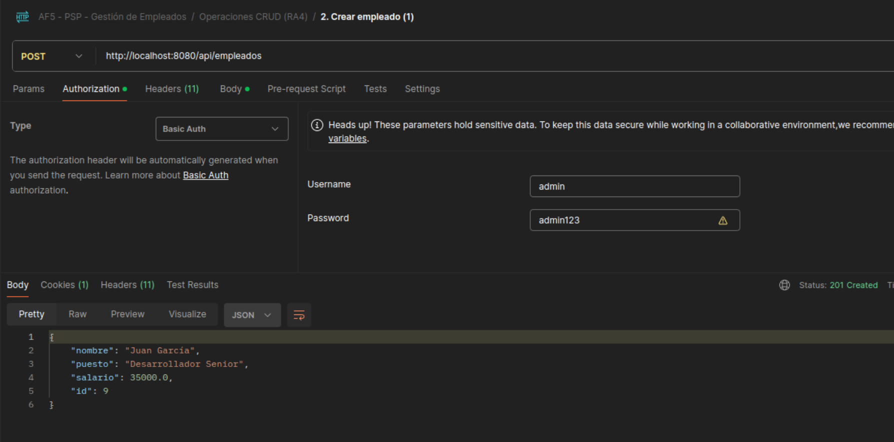
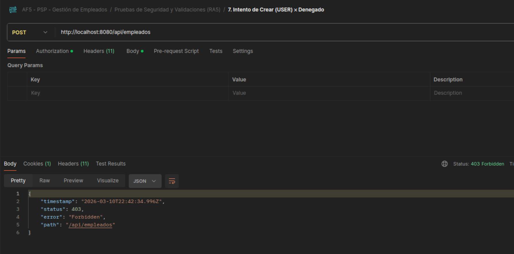
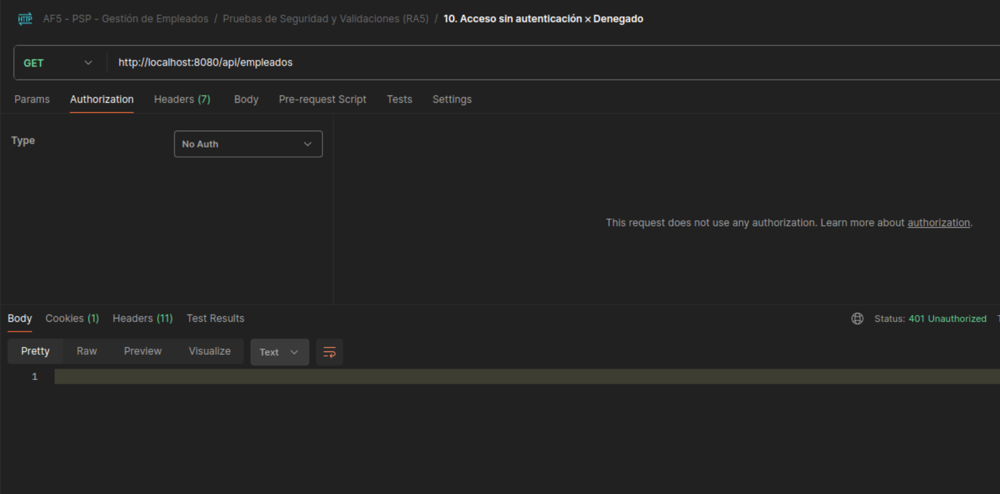
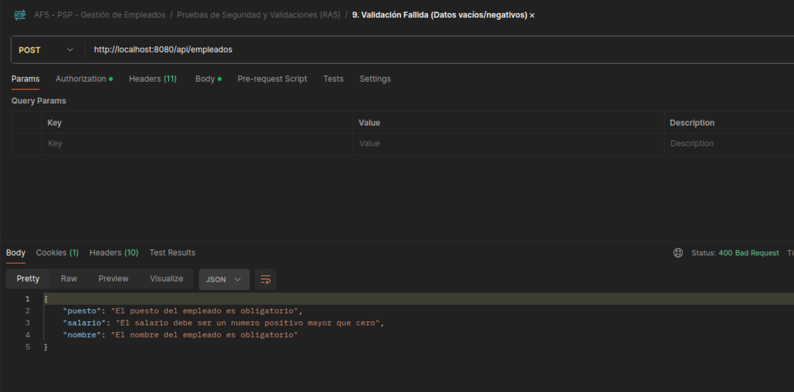

# 🏢 API REST — Gestión de Empleados (AF5 - PSP)

> **Asignatura:** Programación de Servicios y Procesos (PSP)  
> **Actividad:** AF5 — Resultados de Aprendizaje RA4 y RA5  
> **Tecnologías:** Java 21 · Spring Boot 4 · Spring Security · Spring Data JPA · H2 Database · Jakarta Validation  

---

## 📋 Índice

1. [Funcionamiento General y Pruebas (RA4)](#1-funcionamiento-general-y-pruebas-ra4)
2. [Justificación de Criterios RA4](#2-justificación-de-criterios-ra4)
3. [Medidas de Seguridad Aplicadas (RA5)](#3-medidas-de-seguridad-aplicadas-ra5)
4. [Guía de Pruebas con Postman](#4-guía-de-pruebas-con-postman)

---

## 📁 Estructura del Proyecto

```
src/main/java/psp/af5/Gestion_Empleados/
├── GestionDeEmpleadosApplication.java          ← Clase principal (punto de entrada)
├── modelo/
│   └── Empleado.java                           ← Entidad JPA con validaciones
├── repositorio/
│   └── EmpleadoRepositorio.java                ← Interfaz JPA (acceso a datos)
├── servicio/
│   └── EmpleadoServicio.java                   ← Lógica de negocio
├── controlador/
│   └── EmpleadoControlador.java                ← Controlador REST (endpoints)
└── configuracion/
    └── ConfiguracionSeguridad.java             ← Spring Security + BCrypt + Roles
```

---

## 1. Funcionamiento General y Pruebas (RA4)

### 🔗 Endpoints de la API

La API expone los siguientes endpoints REST en la ruta base `/api/empleados`:

| Método HTTP | Endpoint              | Descripción                    | Rol Requerido |
|-------------|----------------------|--------------------------------|---------------|
| `GET`       | `/api/empleados`      | Listar todos los empleados     | USER o ADMIN  |
| `GET`       | `/api/empleados/{id}` | Obtener un empleado por su ID  | USER o ADMIN  |
| `POST`      | `/api/empleados`      | Crear un nuevo empleado        | Solo ADMIN    |
| `PUT`       | `/api/empleados/{id}` | Actualizar un empleado         | Solo ADMIN    |
| `DELETE`    | `/api/empleados/{id}` | Eliminar un empleado           | Solo ADMIN    |

### 👤 Usuarios del Sistema

| Usuario | Contraseña | Rol   | Permisos                         |
|---------|------------|-------|----------------------------------|
| `admin` | `admin123` | ADMIN | Acceso completo (CRUD completo)  |
| `user`  | `user123`  | USER  | Solo lectura (GET)               |

> ⚠️ Las contraseñas se almacenan cifradas con **BCrypt**. No se usa `{noop}` en ningún momento.

### 🚀 Datos Iniciales (DataLoader)

Para facilitar las pruebas, el proyecto incluye una clase `DataLoader` que se ejecuta automáticamente al arrancar Spring Boot. Si la base de datos está vacía, insertará automáticamente **4 empleados de prueba** para que puedas empezar a listar, buscar o actualizar inmediatamente sin tener que hacer POSTS previos.

### 🗄️ Consola H2

Accesible en: `http://localhost:8080/h2-console`

| Parámetro       | Valor                          |
|-----------------|--------------------------------|
| JDBC URL        | `jdbc:h2:file:./data/empleados_db` |
| User Name       | `admin`                        |
| Password        | `admin1234`                    |

---

## 2. Justificación de Criterios (RA4 y RA5)

A continuación se resume cómo el proyecto cumple con los criterios de evaluación exigidos.

### 🌐 RA4 — Servicios en Red

| Criterio | Implementación en el Proyecto |
| :--- | :--- |
| **a) Protocolos estándar** | Uso de HTTP mediante Spring Boot y Tomcat embebido para la comunicación. |
| **b) Clientes y pruebas** | Pruebas documentadas en la sección 3 usando Postman como cliente HTTP. |
| **c) Servicios en red** | API REST desarrollada con 5 endpoints operativos (GET, POST, PUT, DELETE). |
| **d) Análisis multicliente** | Servidor configurado para entornos sin estado (stateless) óptimo para APIs concurrentes. |
| **e) Comunicación simultánea** | Tomcat gestiona peticiones paralelas automáticamente mediante un *pool* de hilos. |
| **f) Disponibilidad** | Base de datos H2 persistente en archivo local (`./data/empleados_db`). |
| **g) Aplicación depurada** | Arquitectura limpia (Controlador, Servicio, Repositorio) y documentada en este README. |

### 🛡️ RA5 — Prácticas de Seguridad

| Criterio | Implementación en el Proyecto |
| :--- | :--- |
| **h) Programación segura** | Pre-validación de los datos entrantes con Jakarta Validation (`@NotBlank`, `@Positive`). |
| **i) Técnicas criptográficas** | Uso de **BCrypt** para encriptar las contraseñas antes de guardarlas. |
| **j) Políticas de acceso** | Solo se permite acceso anónimo a la consola de la BD; la API exige autenticación. |
| **k) Esquemas de roles** | Implementación estricta de roles: `USER` (solo lectura) y `ADMIN` (acceso total). |
| **l) Algoritmos de protección** | `BCryptPasswordEncoder` aplica un *salt* aleatorio creando hashes únicos. |
| **m) Asegurar transmisión** | Protección nativa y automática contra inyecciones SQL proporcionada por **Spring Data JPA**. |
| **n) Sockets/Transmisión** | Implementación de **HTTP Basic Auth**, enviando credenciales en Base64 en las cabeceras. |
| **o) Depuración y seguridad** | Spring Security configura automáticamente cabeceras de seguridad anti-XSS y Clickjacking. |

---

## 3. Guía de Pruebas con Postman

> Para facilitar la corrección, se incluye en la raíz del proyecto el archivo `Coleccion_Postman_AF5.json`.
> Solo hay que abrir Postman, darle a **"Import"** y cargar este archivo. 
> 
> La colección está perfectamente organizada en **2 carpetas**:
> 1. 📁 **Operaciones CRUD (RA4)**: Pruebas 1 a 6.
> 2. 🔒 **Pruebas de Seguridad y Validaciones (RA5)**: Pruebas 7 a 10.
> 
> Te aparecerán automáticamente las 10 pruebas ya configuradas con sus URL, parámetros, cuerpos JSON y los usuarios correctos (Basic Auth) en cada petición.

---

### 📝 Resumen de Pruebas Incluidas en la Colección

La colección contiene las siguientes pruebas preconfiguradas:

**📁 1. Operaciones CRUD (RA4)**
- ✅ Listar todos los empleados (GET - USER)
- ✅ Crear empleado (POST - ADMIN)
- ✅ Crear segundo empleado (POST - ADMIN)
- ✅ Obtener empleado por ID (GET - USER)
- ✅ Actualizar empleado (PUT - ADMIN)
- ✅ Eliminar empleado (DELETE - ADMIN)

**🔒 2. Pruebas de Seguridad y Validaciones (RA5)**
- ❌ Crear empleado como USER `(403 Forbidden)`
- ❌ Eliminar empleado como USER `(403 Forbidden)`
- ❌ Validación fallida con datos vacíos y salario negativo `(400 Bad Request)`
- ❌ Acceso sin autenticación `(401 Unauthorized)`

### 📸 Evidencias de Ejecución (Capturas de Postman)

A continuación, se muestran las evidencias gráficas del correcto funcionamiento de las medidas de seguridad y validaciones implementadas para el **RA5**:

| Prueba / Descripción | Captura de Pantalla |
| :--- | :--- |
| **✅ Acceso Permitido (ADMIN)**<br><br>Demuestra que un usuario autenticado con rol `ADMIN` (admin/admin123) puede acceder al endpoint protegido `/api/empleados` por POST y crear un nuevo registro exitosamente devolviendo un `201 Created`. |  |
| **❌ Acceso Denegado por Rol (USER)**<br><br>Demuestra que un usuario autenticado con rol `USER` (user/user123) no tiene permisos suficientes para realizar acciones destructivas como un DELETE o crear datos por POST. El sistema intercepta la petición y devuelve un `403 Forbidden`. |  |
| **❌ Acceso Denegado sin Autenticación**<br><br>Demuestra que si se intenta acceder a la API (incluso a rutas GET) sin proveer credenciales *Basic Auth*, Spring Security bloquea el acceso de inmediato de forma segura devolviendo un `401 Unauthorized`. |  |
| **⚠️ Error de Validación (Datos Inválidos)**<br><br>Demuestra el funcionamiento de *Jakarta Validation*. Al enviar campos vacíos o salarios negativos por POST, la petición no llega siquiera a afectar la base de datos y se devuelve un `400 Bad Request` indicando qué campos específicos han fallado. |  |

---

## 🚀 Cómo Ejecutar el Proyecto

1. Abrir el proyecto en un IDE (IntelliJ IDEA, Eclipse, VS Code).
2. Ejecutar la clase `GestionDeEmpleadosApplication.java`.
3. El servidor se inicia en `http://localhost:8080`.
4. Abrir Postman y seguir las pruebas de la sección anterior.
5. Para ver los datos directamente en la BD, acceder a `http://localhost:8080/h2-console`.
